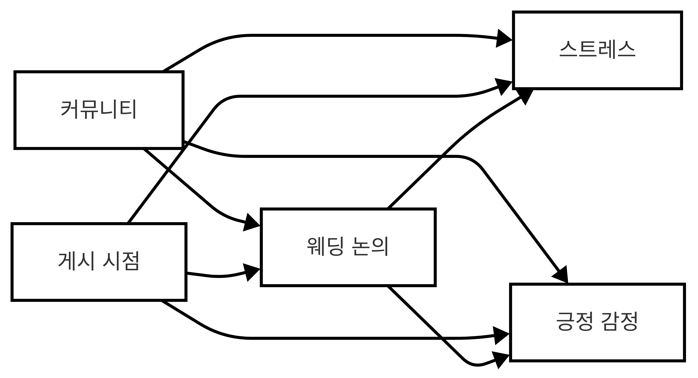

# 웨딩 체형 관리가 감정에 미치는 영향 분석

## 프로젝트 개요

본 프로젝트는 웨딩 준비 과정에서 이루어지는 체형 관리에 대한 논의가 온라인 커뮤니티에서 개인의 스트레스 수준과 긍정적인 정서에 어떤 인과적 영향을 미치는지를 분석한 준실험 연구입니다.

- **목표**: 웨딩 관련 체형 관리 언급이 개인의 정서 지표에 미치는 평균처치효과(ATE) 추정
- **데이터 출처**:

  - [The Knot - Getting in Shape 포럼](https://forums.theknot.com/categories/wedding-boards_getting-shape)
  - [Reddit - r/xxfitness](https://www.reddit.com/r/xxfitness/)

- **주요 지표**:
  - `stress_score`: 스트레스 예측 모델 ([jnyx74/stress-prediction](https://huggingface.co/jnyx74/stress-prediction)) 기반 확률값
  - `positive_score`: 감성 분석 모델 ([cardiffnlp/twitter-roberta-base-sentiment](https://huggingface.co/cardiffnlp/twitter-roberta-base-sentiment))의 긍정 확률값

## 주요 기능 및 분석 절차

1. **데이터 전처리**
   - HTML, URL, 특수문자 제거
   - SBERT(`all-mpnet-base-v2`)로 문장 임베딩 생성
2. **토픽 모델링 및 분류**
   - BERTopic으로 주제 클러스터링 (확률 기반)
   - 사전 정의된 키워드로 웨딩/체형 관련 토픽 자동 분류
3. **처치군(Treatment)·대조군(Control) 할당**
   - 토픽 확률 합산(`wedding_prob`, `body_prob`) 및 키워드 포함 여부
   - 상위 70% 분위수 임계값 기준으로 그룹 분류
4. **정서 점수 산출**
   - **스트레스**: `jnyx74/stress-prediction` 모델
   - **긍정**: `cardiffnlp/twitter-roberta-base-sentiment` 모델
5. **인과 효과 추정 (IPW)**
   - **Propensity Score**: 커뮤니티(`community`) 및 작성 시점(`year_month`)을 혼란변수로 하는 로지스틱 회귀
   - 역확률가중치(IPW) 기반 ATE 및 부트스트랩 신뢰구간 산출
6. **견고성 분석**
   - **민감도 분석**: 임계값(60%·70%·80%)별 ATE 비교
   - **커뮤니티별 이질성**: The Knot vs xxfitness 서브그룹 ATE 분석

## 인과 그래프

본 프로젝트의 인과 구조는 아래와 같습니다.  
웨딩 관련 논의는 스트레스 증가와 긍정 감정 상승이라는 상반된 정서 반응을 유발할 수 있으며,  
커뮤니티 및 게시 시점은 이러한 논의 참여와 정서 지표 모두에 영향을 주는 혼란변수(confounders)로 고려되었습니다.

  

## 결과 요약

- **스트레스**: 웨딩 관련 체형 논의 시 평균 **+0.05** 상승 (95% CI 비포함, 통계적 유의)
- **긍정 정서**: 평균 **+0.04** 상승하나 95% CI에 0 포함 (유의하지 않음)
- **견고성**: 임계값을 높이거나 커뮤니티별로 나누어 분석했을 때에도 효과의 방향성은 유지되었지만, 통계적 유의성은 일부 조건에서만 나타났습니다. 이러한 차이는 정서 반응이 논의의 강도나 맥락에 따라 달라질 수 있음을 보여줍니다.

## 참고 문헌

1. Turcan, R. & McKeown, K. (2019). _Dreaddit: A Corpus for Annotated Stressors and Reactions_. arXiv:1911.00133.
2. Cardiff NLP Team. _Twitter-RoBERTa Sentiment Analysis_ Model.
